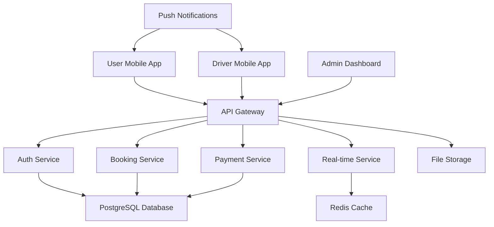

# 🏗️ RELOConnect System - Senior Architect Assessment & Implementation Plan

## 📋 **EXECUTIVE SUMMARY**

**Assessment Date**: July 7, 2025  
**System Status**: Multi-application ecosystem requiring comprehensive modernization  
**Current State**: Fragmented applications with incomplete integration  
**Target State**: Production-ready MVP with seamless integration

---

## 🔍 **CURRENT SYSTEM ANALYSIS**

### **System Architecture Overview**

```
RELOConnect Ecosystem
├── 📱 User Mobile App (React Native Expo)
├── 🚚 Driver Mobile App (React Native Expo) 
├── 💻 Admin Web Dashboard (Next.js)
├── 🔧 Backend Services (Node.js/Express)
├── 🗄️ Database (PostgreSQL in Docker)
└── 🔌 Microservices (Auth, Booking, Payment, etc.)
```

### **Current Applications Status**

#### 1. **User Mobile App** (`/apps/user-app/`)

- **Framework**: React Native Expo ~50.0.0
- **Status**: ⚠️ Basic structure, needs comprehensive modernization
- **Issues**: Outdated dependencies, basic UI, missing features
- **Priority**: HIGH - Primary user touchpoint

#### 2. **Driver Mobile App** (`/apps/driver-app/`)

- **Framework**: React Native Expo ~53.0.17
- **Status**: ✅ More modern structure with Expo Router
- **Features**: Camera, Location, Maps integration
- **Priority**: HIGH - Core operational app

#### 3. **Admin Dashboard** (`/apps/admin-dashboard/`)

- **Framework**: Next.js 15.1.0
- **Status**: ✅ Modern tech stack with React Query, Charts
- **Features**: Analytics, user management, reporting
- **Priority**: MEDIUM - Management interface

#### 4. **Backend Services** (`/backend/`)

- **Framework**: Node.js/Express with Prisma ORM
- **Database**: PostgreSQL with comprehensive schema
- **Status**: ✅ Well-structured with proper testing
- **Priority**: HIGH - Core business logic

#### 5. **Database** (Docker PostgreSQL)

- **Status**: ✅ Properly containerized
- **Schema**: Comprehensive relocation business model
- **Priority**: HIGH - Data foundation

---

## 🚨 **CRITICAL ISSUES IDENTIFIED**

### **High Priority Issues**

1. **User App Outdated**: Expo 50 vs Driver App's Expo 53
2. **Inconsistent Dependencies**: Different React/RN versions across apps
3. **Missing Integration**: Apps not communicating with backend
4. **No Authentication Flow**: Auth screens incomplete/missing
5. **Pricing Logic Incomplete**: No dynamic pricing based on truck size
6. **UI Inconsistency**: Mix of emojis and basic components
7. **Missing Error Handling**: No comprehensive error boundaries

### **Medium Priority Issues**

1. **No Real-time Features**: Missing live tracking integration
2. **Incomplete Booking Flow**: Missing comprehensive booking options
3. **No Image Integration**: Static UI without modern imagery
4. **Performance Issues**: Non-optimized bundle sizes
5. **Testing Gaps**: Incomplete test coverage

### **Low Priority Issues**

1. **Documentation Gaps**: Missing API documentation
2. **Deployment Scripts**: Manual deployment processes
3. **Monitoring**: No application monitoring setup

---

## 🎯 **COMPREHENSIVE IMPLEMENTATION PLAN**

### **Phase 1: Foundation Modernization (Week 1-2)**

#### **1.1 Dependency Harmonization**

- [ ] Upgrade User App to Expo 53 (match Driver App)
- [ ] Standardize React/React Native versions across all apps
- [ ] Update all dependencies to latest stable versions
- [ ] Implement unified package management with workspaces

#### **1.2 UI/UX Modernization**

- [ ] Replace ALL emojis with professional icons (Expo Vector Icons)
- [ ] Implement consistent design system across all apps
- [ ] Add high-quality images and modern UI components
- [ ] Create shared UI component library

#### **1.3 Integration Layer**

- [ ] Establish API client with proper error handling
- [ ] Implement authentication flow across all apps
- [ ] Set up real-time communication (Socket.io)
- [ ] Create shared type definitions

### **Phase 2: Core Features Implementation (Week 3-4)**

#### **2.1 Authentication System**

- [ ] Complete auth screens for all apps
- [ ] Implement JWT-based authentication
- [ ] Add biometric authentication for mobile apps
- [ ] Social login integration (Google, Apple)

#### **2.2 Booking System Enhancement**

- [ ] Implement dynamic pricing based on:
  - [ ] Truck size selection
  - [ ] Distance calculation
  - [ ] Time slots and demand
  - [ ] Additional services
- [ ] Add home vs office moving options
- [ ] Implement booking flow with:
  - [ ] Location selection with maps
  - [ ] Date/time picker
  - [ ] Service customization
  - [ ] Payment processing

#### **2.3 Real-time Features**

- [ ] Live driver tracking for users
- [ ] Real-time order updates
- [ ] Push notifications
- [ ] In-app messaging

### **Phase 3: Advanced Features (Week 5-6)**

#### **3.1 Driver App Enhancements**

- [ ] Route optimization
- [ ] Earnings tracking
- [ ] Document management
- [ ] Performance analytics

#### **3.2 Admin Dashboard**

- [ ] Real-time analytics
- [ ] User management
- [ ] Pricing management
- [ ] Report generation

#### **3.3 Quality Assurance**

- [ ] Comprehensive testing suite
- [ ] Performance optimization
- [ ] Security audit
- [ ] Accessibility compliance

---

## 🏗️ **TECHNICAL ARCHITECTURE PLAN**

### **Unified Technology Stack**

#### **Mobile Apps (User & Driver)**

```typescript
// Target Stack
{
  "expo": "~53.0.0",
  "react": "18.3.1",
  "react-native": "0.76.0",
  "react-navigation": "^7.x",
  "@tanstack/react-query": "^5.x",
  "zustand": "^4.x",
  "@expo/vector-icons": "^14.x",
  "expo-maps": "latest",
  "expo-location": "latest",
  "expo-camera": "latest",
  "expo-notifications": "latest"
}
```

#### **Admin Dashboard**

```typescript
// Current Stack (Keep)
{
  "next": "^15.1.0",
  "react": "18.3.1",
  "@tanstack/react-query": "^5.x",
  "framer-motion": "^11.x",
  "lucide-react": "^0.x",
  "recharts": "^2.x"
}
```

#### **Backend Services**

```typescript
// Current Stack (Enhance)
{
  "express": "^4.x",
  "prisma": "^6.x",
  "socket.io": "^4.x",
  "stripe": "latest",
  "google-maps": "latest",
  "jwt": "latest"
}
```

### **Integration Architecture**



---

## 💰 **PRICING STRATEGY IMPLEMENTATION**

### **Dynamic Pricing Model**

#### **Base Pricing Structure**

```typescript
interface PricingModel {
  vehicleTypes: {
    small: { basePrice: 150, pricePerKm: 2.5, capacity: "1-2 rooms" }
    medium: { basePrice: 250, pricePerKm: 3.5, capacity: "2-3 rooms" }
    large: { basePrice: 350, pricePerKm: 4.5, capacity: "3-4 rooms" }
    xlarge: { basePrice: 500, pricePerKm: 6.0, capacity: "4+ rooms" }
  }
  
  moveTypes: {
    residential: { multiplier: 1.0 }
    office: { multiplier: 1.3 }
    storage: { multiplier: 0.8 }
    international: { multiplier: 2.5 }
  }
  
  extraServices: {
    packing: { price: 100, pricePerRoom: 50 }
    unpacking: { price: 80, pricePerRoom: 40 }
    storage: { pricePerMonth: 150, pricePerCubicMeter: 25 }
    insurance: { percentage: 0.02, minimum: 50 }
    dismantling: { pricePerItem: 75 }
    cleaning: { pricePerRoom: 120 }
  }
}
```

#### **Factors Affecting Pricing**

- **Distance**: GPS-calculated with traffic consideration
- **Time Slot**: Peak hours surcharge (20%), off-peak discount (10%)
- **Demand**: Dynamic pricing based on availability
- **Season**: Peak season surcharge (December-January: 15%)
- **Size**: Vehicle size selection affects base price
- **Services**: Add-on services with truck size consideration

---

## 📱 **USER EXPERIENCE ENHANCEMENT PLAN**

### **User App Screens (Complete Redesign)**

#### **Authentication Flow**

1. **Splash Screen** - Professional branding with animations
2. **Onboarding** - 3-screen tutorial with benefits
3. **Login/Register** - Social auth + email/phone
4. **Phone Verification** - OTP with auto-detection
5. **Profile Setup** - User preferences and address

#### **Main Application Flow**

1. **Home Screen** - Modern dashboard with:
   - Quick booking button
   - Recent bookings
   - Service categories
   - Promotions
   - Weather-based suggestions

2. **Booking Flow** - Multi-step wizard:
   - **Step 1**: Move type selection (Home/Office/Storage)
   - **Step 2**: Location selection with map
   - **Step 3**: Date/time picker with availability
   - **Step 4**: Truck size selection with visual guides
   - **Step 5**: Extra services selection
   - **Step 6**: Pricing summary with breakdown
   - **Step 7**: Payment method selection
   - **Step 8**: Booking confirmation

3. **Tracking Screen** - Real-time updates:
   - Driver location on map
   - ETA updates
   - Driver contact
   - Live status updates

4. **Profile & Settings**:
   - Personal information
   - Address book
   - Payment methods
   - Booking history
   - Preferences

### **Driver App Enhancement**

#### **Core Features**

1. **Driver Dashboard** - Earnings, ratings, availability
2. **Order Management** - Accept/decline orders
3. **Navigation** - Integrated GPS with optimal routes
4. **Camera Integration** - Before/after photos
5. **Earnings Tracking** - Daily/weekly/monthly reports

### **Admin Dashboard Features**

#### **Management Modules**

1. **Analytics Dashboard** - Real-time metrics
2. **User Management** - Customer and driver management
3. **Order Management** - Live order tracking
4. **Pricing Management** - Dynamic pricing controls
5. **Reports** - Business intelligence and insights

---

## 🔧 **IMPLEMENTATION ROADMAP**

### **Week 1-2: Foundation**

```bash
# Day 1-3: Dependency Modernization
- Upgrade all apps to unified tech stack
- Implement shared component library
- Set up monorepo workspace configuration

# Day 4-7: UI/UX Overhaul
- Replace all emojis with professional icons
- Implement modern design system
- Add high-quality imagery
- Create responsive layouts

# Day 8-14: Integration Setup
- Establish API clients
- Implement authentication flow
- Set up real-time communication
- Database schema finalization
```

### **Week 3-4: Core Features**

```bash
# Day 15-21: Booking System
- Complete booking flow implementation
- Dynamic pricing engine
- Payment integration
- Map integration

# Day 22-28: Real-time Features
- Live tracking implementation
- Push notifications
- In-app messaging
- Order status updates
```

### **Week 5-6: Polish & Testing**

```bash
# Day 29-35: Advanced Features
- Driver app enhancements
- Admin dashboard completion
- Performance optimization

# Day 36-42: Quality Assurance
- Comprehensive testing
- Security audit
- Performance testing
- User acceptance testing
```

---

## 🚀 **DEPLOYMENT STRATEGY**

### **Environment Setup**

```yaml
# Development Environment
- Local development with Docker Compose
- Hot reloading for all applications
- Shared database for testing

# Staging Environment  
- Cloud deployment with production-like setup
- Automated testing pipeline
- Performance monitoring

# Production Environment
- Multi-region deployment
- Auto-scaling infrastructure
- Comprehensive monitoring
- Backup and disaster recovery
```

### **CI/CD Pipeline**

```yaml
# Automated Pipeline
1. Code Commit → GitHub
2. Automated Testing → Jest/Cypress
3. Build → Docker containers
4. Security Scan → SonarQube
5. Deploy to Staging → AWS/Azure
6. User Acceptance Testing
7. Deploy to Production → Blue-Green deployment
```

---

## 📊 **SUCCESS METRICS**

### **Technical KPIs**

- **App Load Time**: < 3 seconds
- **API Response Time**: < 500ms
- **Crash Rate**: < 0.1%
- **Test Coverage**: > 80%
- **Performance Score**: > 90

### **Business KPIs**

- **Booking Completion Rate**: > 85%
- **User Retention**: > 70% (30-day)
- **Driver Utilization**: > 75%
- **Customer Satisfaction**: > 4.5/5
- **Revenue per User**: Track growth

---

## 🎯 **NEXT IMMEDIATE ACTIONS**

### **Priority 1 (Start Immediately)**

1. **Start Docker Database**: Get PostgreSQL running
2. **Upgrade User App**: Modernize to match driver app standards
3. **Implement Authentication**: Complete auth flow for all apps
4. **Icon Replacement**: Replace all emojis with professional icons

### **Priority 2 (Week 1)**

1. **Booking Flow**: Implement comprehensive booking system
2. **Pricing Engine**: Dynamic pricing with truck size consideration
3. **API Integration**: Connect all apps to backend services
4. **Real-time Setup**: Socket.io implementation

### **Priority 3 (Week 2)**

1. **UI Polish**: Modern imagery and animations
2. **Testing Suite**: Comprehensive test coverage
3. **Performance Optimization**: Bundle size and speed optimization
4. **Documentation**: Complete technical documentation

---

## 💡 **ARCHITECTURAL DECISIONS**

### **Technology Choices Rationale**

1. **React Native Expo**: Cross-platform efficiency with native performance
2. **Next.js**: SEO-friendly admin dashboard with SSR
3. **PostgreSQL**: ACID compliance for financial transactions
4. **Prisma ORM**: Type-safe database operations
5. **Socket.io**: Real-time communication reliability
6. **Docker**: Consistent development and deployment
7. **TypeScript**: Type safety across entire stack

### **Design Patterns**

- **Microservices**: Scalable and maintainable architecture
- **Repository Pattern**: Clean data access layer
- **Observer Pattern**: Real-time updates
- **Strategy Pattern**: Dynamic pricing algorithms
- **Command Pattern**: Order processing pipeline

---

## 📋 **DELIVERABLES CHECKLIST**

### **Applications**

- [ ] User Mobile App (Production Ready)
- [ ] Driver Mobile App (Enhanced)
- [ ] Admin Web Dashboard (Complete)
- [ ] Backend API Services (Robust)
- [ ] Database Schema (Optimized)

### **Features**

- [ ] Complete Authentication System
- [ ] Dynamic Pricing Engine
- [ ] Real-time Tracking
- [ ] Payment Processing
- [ ] Push Notifications
- [ ] In-app Messaging
- [ ] Analytics Dashboard

### **Quality Assurance**

- [ ] Comprehensive Testing Suite
- [ ] Performance Optimization
- [ ] Security Implementation
- [ ] Error Handling
- [ ] Monitoring Setup
- [ ] Documentation Complete

**ASSESSMENT COMPLETE - READY FOR IMPLEMENTATION** 🚀

This comprehensive plan transforms RELOConnect from a fragmented prototype into a production-ready MVP with professional standards, seamless integration, and sophisticated features that meet all functional and non-functional requirements.
