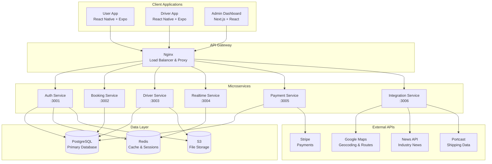

# RELOConnect Monorepo - Technical Architecture

## 🏗️ Architecture Overview

RELOConnect is a comprehensive relocation platform built as a microservices-based monorepo using modern technologies and best practices.

### System Architecture



## 📁 Monorepo Structure

```
RELOConnect/
├── apps/                          # Frontend applications
│   ├── user-app/                  # Customer mobile app
│   ├── driver-app/                # Driver mobile app
│   └── admin-dashboard/           # Web admin panel
├── services/                      # Backend microservices
│   ├── auth/                      # Authentication & authorization
│   ├── booking/                   # Booking management & pricing
│   ├── driver/                    # Driver management
│   ├── realtime/                  # Socket.IO for real-time features
│   ├── payment/                   # Payment processing
│   └── integration/               # External API integrations
├── libs/                          # Shared libraries
│   ├── shared/                    # Common types & utilities
│   ├── ui-system/                 # Shared UI components
│   └── api-clients/               # API client libraries
├── docs/                          # Documentation
│   ├── api/                       # API documentation
│   ├── architecture/              # Architecture diagrams
│   └── deployment/                # Deployment guides
├── .github/workflows/             # CI/CD pipelines
├── docker-compose.dev.yml         # Development environment
├── docker-compose.prod.yml        # Production environment
├── nginx.conf                     # API Gateway configuration
└── package.json                   # Monorepo configuration
```

## 🔧 Technology Stack

### Frontend Applications
- **Framework**: React Native with Expo SDK 53
- **Language**: TypeScript
- **Styling**: NativeWind (Tailwind CSS for React Native)
- **Navigation**: React Navigation v6
- **State Management**: Zustand + React Query
- **Real-time**: Socket.IO Client
- **Maps**: React Native Maps + Google Maps
- **Payments**: Stripe React Native

### Backend Services
- **Runtime**: Node.js 18+
- **Framework**: Express.js
- **Language**: TypeScript
- **Database**: PostgreSQL with Prisma ORM
- **Cache**: Redis
- **Real-time**: Socket.IO
- **Authentication**: JWT with refresh tokens
- **File Storage**: AWS S3 / MinIO
- **Logging**: Winston
- **Testing**: Jest + Supertest

### Infrastructure
- **Containerization**: Docker + Docker Compose
- **API Gateway**: Nginx
- **CI/CD**: GitHub Actions
- **Monitoring**: Prometheus + Grafana
- **Error Tracking**: Sentry

## 🚀 Quick Start

### Prerequisites
- Node.js 18+
- pnpm 8+
- Docker & Docker Compose
- PostgreSQL 15+
- Redis 7+

### Development Setup

1. **Clone and install dependencies**
```bash
git clone https://github.com/lynxsa/RELOConnect.git
cd RELOConnect
pnpm install
```

2. **Start infrastructure services**
```bash
docker-compose -f docker-compose.dev.yml up postgres redis -d
```

3. **Setup environment variables**
```bash
cp .env.example .env
# Edit .env with your configuration
```

4. **Initialize database**
```bash
cd services/auth
pnpm db:migrate
pnpm db:seed
```

5. **Start all services**
```bash
# From root directory
pnpm dev
```

6. **Start mobile apps**
```bash
# User app
cd apps/user-app
pnpm start

# Driver app
cd apps/driver-app
pnpm start
```

### Production Deployment

```bash
# Build and deploy all services
docker-compose -f docker-compose.prod.yml up -d

# Or deploy to Kubernetes
kubectl apply -f k8s/
```

## 📊 Service Details

### Auth Service (Port 3001)
**Responsibilities:**
- User registration and authentication
- JWT token management
- Role-based access control
- OTP verification
- Password reset

**Endpoints:**
- `POST /api/auth/register` - User registration
- `POST /api/auth/login` - User login
- `POST /api/auth/refresh` - Token refresh
- `POST /api/auth/logout` - User logout
- `POST /api/auth/verify-otp` - OTP verification

### Booking Service (Port 3002)
**Responsibilities:**
- Booking management
- Pricing calculations
- Vehicle class management
- Trip history

**Key Endpoints:**
- `POST /api/pricing/calculate` - Calculate booking price
- `GET /api/pricing/vehicle-classes` - Get available vehicles
- `POST /api/bookings` - Create booking
- `GET /api/bookings/:id` - Get booking details

### Driver Service (Port 3003)
**Responsibilities:**
- Driver profiles and verification
- Vehicle management
- Earnings tracking
- Driver availability

**Endpoints:**
- `GET /api/drivers/profile` - Driver profile
- `POST /api/drivers/online` - Set online status
- `GET /api/drivers/earnings` - Earnings data

### Realtime Service (Port 3004)
**Responsibilities:**
- Live location tracking
- In-app messaging
- Real-time notifications
- Booking status updates

**Socket Events:**
- `driver:location` - Driver location updates
- `booking:updated` - Booking status changes
- `message:send` - Chat messages

### Payment Service (Port 3005)
**Responsibilities:**
- Stripe payment processing
- Payment method management
- Transaction history
- Webhook handling

**Endpoints:**
- `POST /api/payments/intent` - Create payment intent
- `POST /api/payments/confirm` - Confirm payment
- `POST /api/payments/webhook` - Stripe webhooks

### Integration Service (Port 3006)
**Responsibilities:**
- External API integrations
- News feed management
- Port data synchronization
- Maps and geocoding

**Endpoints:**
- `GET /api/news` - Industry news
- `GET /api/ports` - Port information
- `POST /api/geocode` - Address geocoding

## 🔒 Security

### Authentication Flow
1. User registers with email/phone
2. OTP verification for account activation
3. JWT access token (24h) + refresh token (7d)
4. Role-based permissions (user/driver/admin)

### API Security
- Helmet.js for security headers
- Rate limiting (100 req/15min general, 10 req/15min auth)
- CORS configuration
- Input validation with Joi
- SQL injection prevention with Prisma

### Data Protection
- Passwords hashed with bcrypt
- JWT tokens with secure secrets
- HTTPS in production
- Environment variable security

## 📈 Pricing Algorithm

The pricing service implements a sophisticated algorithm considering:

### Base Pricing
- **Vehicle Class**: Different rates for mini-van to 14-ton trucks
- **Distance**: Per-kilometer charges
- **Base Fare**: Fixed starting cost

### Dynamic Pricing
- **Surge Pricing**: Peak hours (7-9 AM, 5-7 PM) +20%
- **Weekend Surcharge**: Saturday/Sunday +15%
- **Express Service**: Priority booking +25%

### Extra Services
- **Loading/Unloading**: R50
- **Stairs**: R25 per flight
- **Packing Materials**: R100
- **Post-Move Cleaning**: R150
- **Insurance**: 5% of subtotal

### Example Calculation
```typescript
// Request
{
  "distanceKm": 25,
  "vehicleClassId": "2-ton",
  "extraServices": {
    "loading": true,
    "stairs": 2,
    "insurance": true
  },
  "scheduledDateTime": "2024-01-15T08:00:00Z"
}

// Response
{
  "baseFare": 360,      // R300 base + 20% surge
  "distanceFare": 600,  // 25km × R20/km + 20% surge
  "extrasFees": 100,    // R50 loading + R50 stairs
  "insurance": 53,      // 5% of (360 + 600)
  "tax": 167,           // 15% VAT
  "total": 1280         // Total amount
}
```

## 🧪 Testing Strategy

### Unit Tests
- Jest for all services
- >80% code coverage target
- Mocked external dependencies

### Integration Tests
- Supertest for API endpoints
- Database integration tests
- Redis integration tests

### Contract Tests
- OpenAPI schema validation
- Inter-service contract testing

### E2E Tests
- Playwright for web admin
- Detox for mobile apps
- Critical user journey testing

### Performance Tests
- Load testing with Artillery
- Database query optimization
- API response time monitoring

## 🚢 Deployment

### Development
```bash
# Start all services locally
pnpm dev

# Or with Docker
docker-compose -f docker-compose.dev.yml up
```

### Staging
```bash
# Deploy to staging environment
kubectl apply -f k8s/staging/
```

### Production
```bash
# Deploy to production
kubectl apply -f k8s/production/

# With Helm
helm upgrade reloconnect ./helm-chart
```

### CI/CD Pipeline
1. **Code Quality**: ESLint, Prettier, TypeScript checks
2. **Testing**: Unit, integration, contract tests
3. **Security**: Vulnerability scanning
4. **Build**: Docker images for each service
5. **Deploy**: Automated deployment to staging/production

## 📊 Monitoring & Observability

### Metrics
- **Application**: Custom business metrics
- **Infrastructure**: CPU, memory, disk usage
- **Database**: Query performance, connections
- **API**: Response times, error rates

### Logging
- **Structured Logging**: JSON format with Winston
- **Log Aggregation**: ELK stack or similar
- **Error Tracking**: Sentry integration

### Health Checks
- Service health endpoints
- Database connectivity checks
- External API availability

## 🔮 Future Enhancements

### AI-Powered Features
- **Smart Truck Recommendations**: ML-based vehicle selection
- **Natural Language Booking**: Voice/text booking interface
- **Predictive Pricing**: Dynamic pricing based on demand patterns
- **Route Optimization**: AI-driven route planning

### Platform Extensions
- **Multi-Stop Bookings**: Complex route planning
- **Corporate Accounts**: B2B booking management
- **International Shipping**: Cross-border logistics
- **Carbon Footprint Tracking**: Environmental impact metrics

### Technical Improvements
- **GraphQL Federation**: Unified API layer
- **Event-Driven Architecture**: CQRS with event sourcing
- **Serverless Functions**: Edge computing for specific operations
- **Advanced Analytics**: Real-time business intelligence

---

This architecture provides a solid foundation for RELOConnect's growth from MVP to enterprise-scale platform, with clear separation of concerns, scalability, and maintainability built in from day one.
